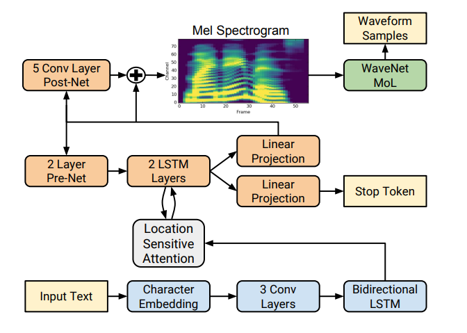

# Tacotron 2
An implementaionon of End-to-End TTS model Tacotron 2 with PyTorch.




## Develop Environment
This is My develop environment.

- Ubuntu 18.04
- Python 3.7
- Pytorch 1.13.0
    
## Requirements
First, Install PyTorch package for your develop environment. Please refer this link([Pytorch](https://pytorch.org/)).

```
conda install pytorch -c pytorch
```

## Reference
- [Natural TTS Synthesis by Conditioning WaveNet on Mel Spectrogram Predictions](https://arxiv.org/abs/1712.05884).

## Author
* SeungHyun Lee [@whsqkaak](https://github.com/whsqkaak)
* Contacts: whsqkaak@naver.com
